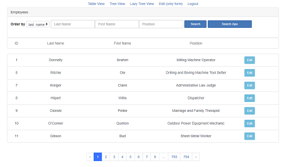
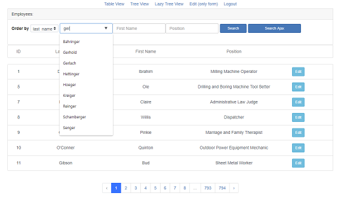
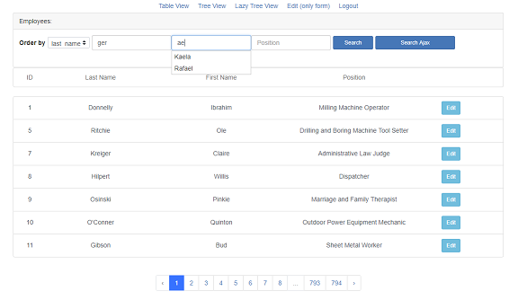
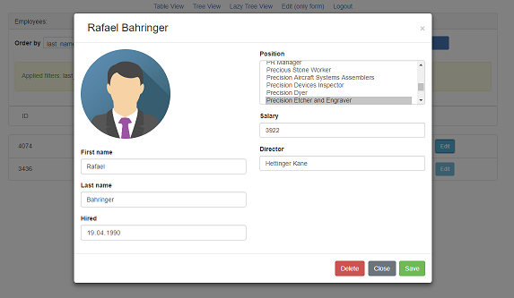
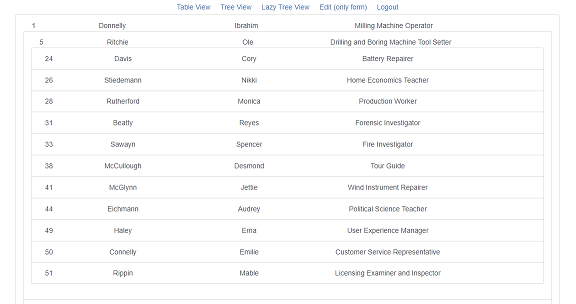

# employee.loc
Laravel 5.7
 jQuery/Ajax

 <b>Задача:</b>
 Поработать с ajax и Laravel

 <b>Установка:</b>
 composer install
 Подправить .env с доступом к БД
 php artisan key:generate
 php artisan migrate --seed
 Зарегистрировать своего пользователя на сайте 

 <b>Особенности проекта:</b>
1. Для создания и заполнения базы данных использовались миграции и Laravel seeder.
2. Страница с выводом всех сотрудников:
 
 Реализована возможность сортировать и искать по любому полю, как с перезагрузкой страницы, так и без перезагрузки, используя ajax.
3. Реализована возможность автозаполнения полей двумя способами:
 а) 
 
 б)
 

4. Весь функционал доступен только зарегистрированным пользователям. 
5. Есть возможность изменять данные сотрудников в модальном окне, а так же загружать фотографию
 
6. На странице Tree View показано дерево сотрудников, с возможностью изменения начальника путем перетаскивание на нужное место
7. На странице Lazy Tree View реализована ленивая загрузка в дерево сотрудников
 

